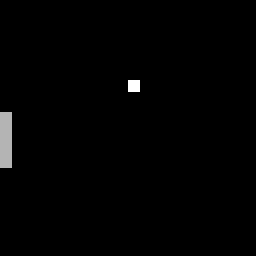
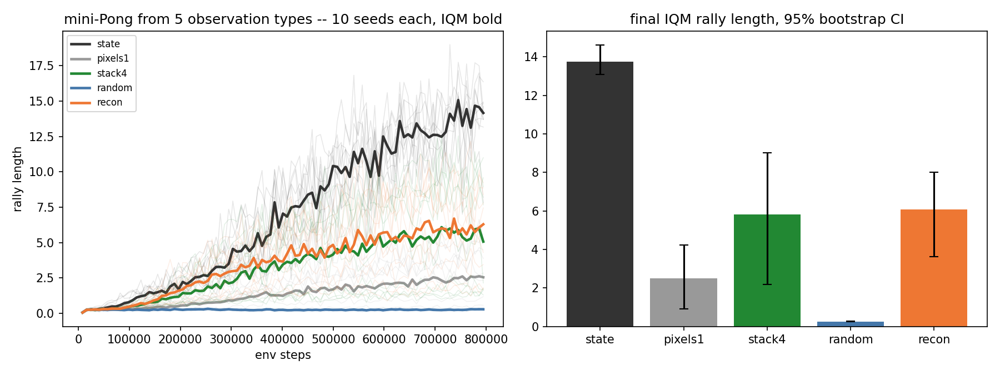

# napkin-pixels

Repo 2 of the **[napkin-gamemaster series](https://github.com/arose26/napkin-gamemaster)** (series home and index). [napkin-returns](https://github.com/arose26/napkin-returns) settled the algorithm (data reuse does the lifting; the clip is free insurance; nothing ships under 5 seeds). This repo holds the algorithm fixed and varies exactly one thing — **what the agent sees** — to answer:

> **What does learning from pixels actually cost, relative to privileged state — and what's the cheapest pair of glasses that buys the difference back?**



## The trick that makes the comparison clean

The env is a mini-Pong written as ~100 lines of batched numpy that emits **both observations for the same timestep**: a privileged 5-float state (ball x, y, vx, vy, paddle y) and a 64×64 frame rendered from it. Same physics, same rewards, same seeds — the *only* difference between arms is the eyes. No gym, no pygame; `selfcheck` asserts the batched env is **exactly** equal to independently stepped single envs for 600 steps, renders included.

Reward: +1 per paddle hit, episode ends on a miss; the ball speeds up 3% per hit, so every extra point is genuinely harder and an episode return *is* the rally length.

| arm | observation | trainable vision? |
|---|---|---|
| `state` | 5 floats | (upper bound) |
| `pixels1` | current frame | yes |
| `stack4` | last 4 frames | yes |
| `random` | last 4 frames → **frozen random convs** | only the 256-d head |
| `recon` | last 4 frames | yes + auxiliary reconstruction loss |

Two of the arms carry *proofs* instead of vibes:

- `selfcheck` decodes ball and paddle positions back **out of the pixels** analytically (within 1.5px), so any gap between `state` and `stack4` is optimization cost, not information loss.
- It also renders two states differing only in velocity and asserts the frames are **identical** — `pixels1`'s handicap is a theorem, not a hunch.

## Hypothesis (registered before the sweep finished)

1. `stack4` reaches `state`'s final rally length but needs **2–3× the samples** to get there — the cost of pixels is a sample-efficiency tax, not a ceiling.
2. `pixels1` caps well below everything (it cannot see velocity; the ball's direction is unknowable from its input).
3. `random` frozen features land **embarrassingly close** to `stack4` — the objects here are indicator pixels, nearly linearly decodable, so learned convs shouldn't matter much.
4. `recon` neither helps nor hurts (+/− noise) at this scale.

## Results

Final IQM rally length over the last 10% of training, 95% bootstrap CI, 10 seeds per arm, 800k env steps each.

| arm | IQM rally | CI |
|---|---:|---|
| `state` | **13.76** | [13.09, 14.60] |
| `pixels1` | 2.49 | [0.91, 4.22] |
| `stack4` | 5.83 | [2.17, 9.03] |
| `random` | 0.26 | [0.25, 0.27] |
| `recon` | 6.06 | [3.64, 7.99] |



Reading it, scored against the registered predictions:

- **Pixels are not a sample tax here — they are a ceiling. Prediction 1 was wrong.** `stack4` does not approach `state` late; it sits at 42% of it with the gap still *widening* at 800k steps (P(state > stack4) = 1.000 under seed bootstrap). Whatever "2–3× more samples" story we registered, the truth at this budget is a different regime, not a delayed copy of the same one.
- **The velocity handicap is real and big — prediction 2 right.** `pixels1`, which provably cannot see the ball's direction (the selfcheck renders the proof), reaches 2.49 vs `stack4`'s 5.83 — P(stack4 > pixels1) = 0.952. The framestack is load-bearing.
- **Frozen random features were a disaster — prediction 3 catastrophically wrong.** We predicted "embarrassingly close"; `random` scored 0.26, barely above doing nothing. In hindsight the mechanism is visible: the ball is ~9 bright pixels in 4096; random convolutions smear that needle across features that a 256-unit head cannot un-smear. Sparse indicator observations are exactly where *learned* vision earns its keep — the opposite of the folk intuition that "nearly linear tasks don't need learned encoders".
- **The auxiliary reconstruction loss is a wash — prediction 4 right.** `recon` 6.06 vs `stack4` 5.83, P(recon > stack4) = 0.517: a coin flip. Reported as the tie it is (the napkin-returns rule).
- **Unregistered but important: pixel RL is loud.** `stack4`'s seed CI spans [2.2, 9.0] — some seeds learn well, some barely move — while `state`'s spans 1.5 points. Observation type didn't just move the mean; it multiplied the variance. Downstream repos budget seeds accordingly.

The lesson napkin-gamemaster inherits: **framestack and learned convolutions are non-negotiable; self-supervised auxiliaries are optional; privileged-state performance is not a target pixels will meet at napkin budgets — plan for the pixels regime, don't extrapolate from the state one.**

## Run it

```bash
pip install --target .deps "numpy<2"
PYTHONPATH=.deps python3.10 napkin_pixels.py selfcheck   # ~2 min, asserts everything above
PYTHONPATH=.deps python3.10 napkin_pixels.py sweep       # 5 arms x 10 seeds, ~1 h on a 6GB GPU
PYTHONPATH=.deps python3.10 napkin_pixels.py plot
PYTHONPATH=.deps python3.10 napkin_pixels.py gif
```

## What's deliberately not here

No gym/gymnasium (the batched env **is** the dependency-free point), no image augmentation, no observation normalization beyond /255, no encoder zoo — one CNN, frozen or not. The five arms and their two selfcheck proofs are the whole experiment.

## Model

Shared trunk + policy/value heads. Pixels arms: conv 8×8/4 (16ch) → conv 4×4/2 (32ch) → fc 256; state arm: MLP 5→64→256. PPO exactly as measured in napkin-returns: γ=0.99, λ=0.95, clip 0.2, 4 epochs, minibatch 1024, Adam 2.5e-4, 64 envs × 128 horizon. 800k env steps per run ≈ 70 s (`state`) to ~2 min (`recon`) on an RTX 4050.
